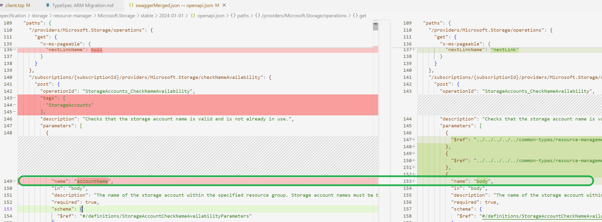
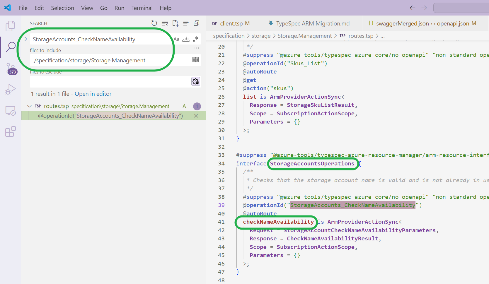
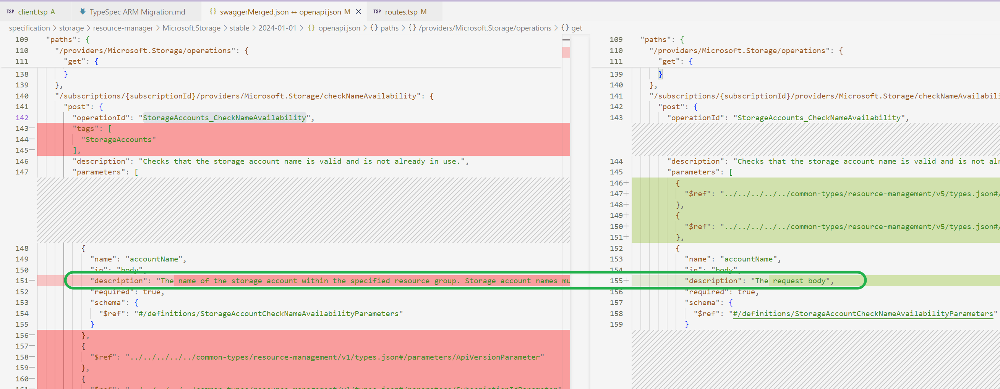
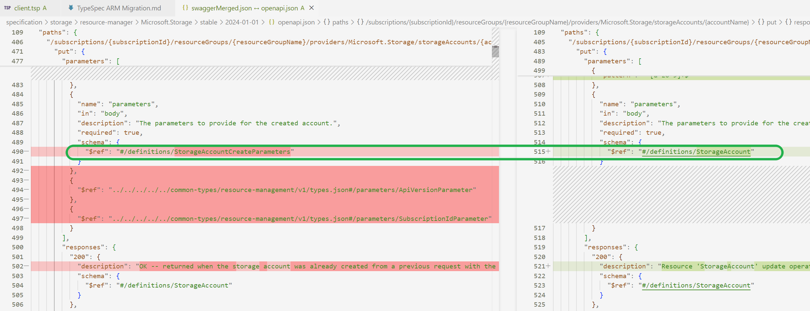
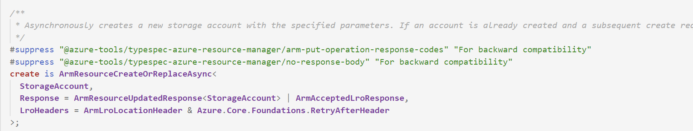
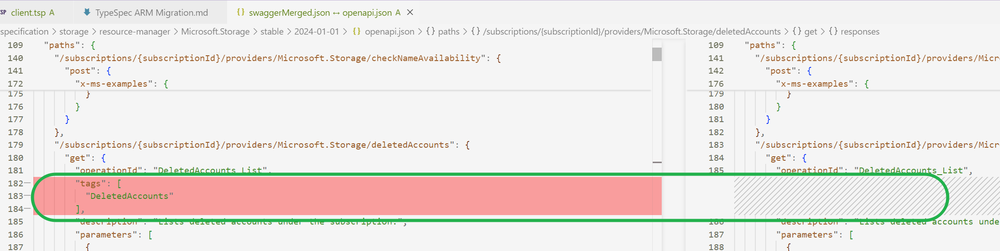
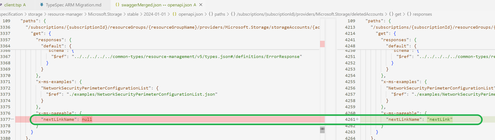
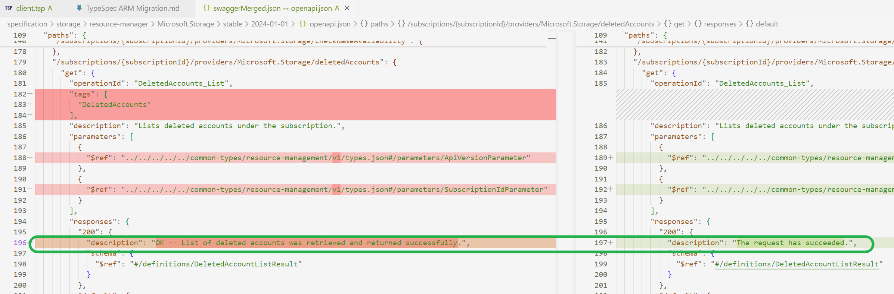
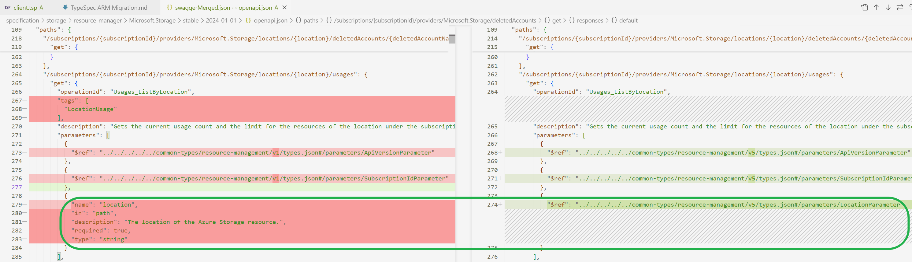
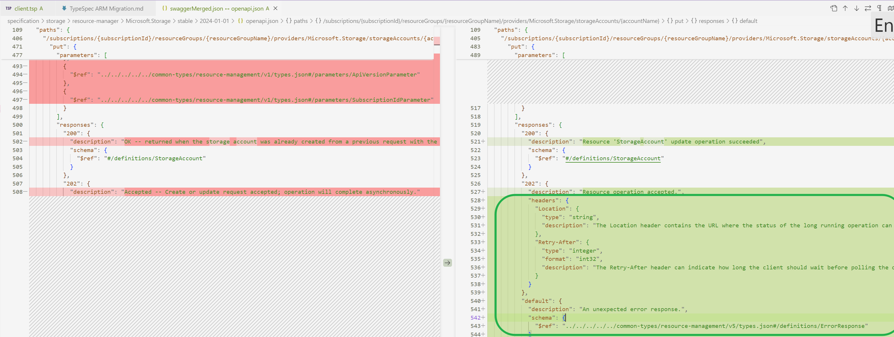

# TypeSpec ARM Migration

<!-- TOC -->
- [TypeSpec ARM Migration](#typespec-arm-migration)
  - [Getting started with TypeSpec migration](#getting-started-with-typespec-migration)
  - [1. Softwares to install](#1-softwares-to-install)
  - [2. Environment Preparation](#2-environment-preparation)
  - [3. Convert a control-plane specification](#3-convert-a-control-plane-specification)
  - [4. Compile the converted TypeSpec into Swagger for comparsion with original Swagger.](#4-compile-the-converted-typespec-into-swagger-for-comparsion-with-original-swagger)
  - [5. Initial pass through checklist](#5-initial-pass-through-checklist)
  - [6. Resolving Swagger Breaking Change Violations](#6-resolving-swagger-breaking-change-violations)
    - [6.1 Sort the original swagger and merge into one file.](#61-sort-the-original-swagger-and-merge-into-one-file)
    - [6.2 Compare the `swaggerMerged.json` and `openapi.json`](#62-compare-the-swaggermergedjson-and-openapijson)
  - [7. Fix the differences](#7-fix-the-differences)
    - [7.1 Common differences and repair methods](#71-common-differences-and-repair-methods)
      - [Renaming: "in": "body"](#renaming-in-body)
      - [description diff](#description-diff)
      - [Response code differences](#response-code-differences)
      - [Missing extended attribute for marking long-running operations](#missing-extended-attribute-for-marking-long-running-operations)
      - [Modification Type](#modification-type)
      - [Missing format](#missing-format)
      - [headers Etag fix](#headers-etag-fix)
      - [Some warnings have appeared](#some-warnings-have-appeared)
      - [example missing](#example-missing)
      - [x-ms-pageable missing](#x-ms-pageable-missing)
      - [x-ms-enum name missing](#x-ms-enum-name-missing)
      - [customize body parameter](#customize-body-parameter)
      - [url path: default/singleton diff](#url-path-defaultsingleton-diff)
    - [7.2 Negligible differences](#72-negligible-differences)
      - [Operation tags](#operation-tags)
      - [The value of nextlink in x-ms-pageable](#the-value-of-nextlink-in-x-ms-pageable)
      - [Response description](#response-description)
      - [Equivalent $ref and inline content](#equivalent-ref-and-inline-content)
      - [Response 202 headers RetryAfter](#response-202-headers-retryafter)
  - [8. Error Handling](#8-error-handling)
    - [Error: ambiguous name: ProxyResource](#error-ambiguous-name-proxyresource)
  - [9. Generate SDK from TSP](#9-generate-sdk-from-tsp)
    - [1. Initial pass through checklist](#1-initial-pass-through-checklist)
<!-- /TOC -->
---

## Getting started with TypeSpec migration
Getting started with TypeSpec migration
We have created a swagger to TypeSpec conversion tool to help take on the bulk of the manual conversion labor. It can handle both data-plane and management-plane swaggers. The produced TypeSpec relies on the Azure.Core and Azure.Resource.Manager libraries.

**Important**! Because TypeSpec is more expressive than Swagger and with the help of evolving Azure libraries, this tool should only be used as an aid in the conversion/migration process, not as the sole tool to produce final version of TypeSpec specs without human inspection, correction and optimization.

---

## 1. Softwares to install

- Ensure Node.js 18.3 LTS or later is installed.

- Ensure the latest Visual Studio Code is installed.

---

## 2. Environment Preparation
- Install @typespec/compiler
```
npm install -g @typespec/compiler
```

- Run at root of azure-rest-api-specs
```Terminal window
npm install 
 ```

- name your ARM spec folder with  `{{YourService}}.Management`（e.g：`Storage.Management`）under Resource Provider specification folder like :
`\azure-rest-api-specs\specification\storage\Storage.Management\`

---

## 3. Convert a control-plane specification

Run under the directory of step 2 which is `{{YourService}}.Management` for which outputs TypeSpec in this directory. 
Ensure it compiles successfully locally.
```
tsp-client convert --swagger-readme [path to readme.md] --arm --fully-compatible
```
By default, the converted TypeSpec project will leverage TypeSpec built-in libraries with standard patterns and templates (highly recommended), 
which will cause discrepancies between the generated TypeSpec and original swagger which we will mitigate this in the following steps.

---
## 4. Compile the converted TypeSpec into Swagger for comparsion with original Swagger.

- Run under the directory of step 2 which is `{{YourService}}.Management`. Ensure it compiles successfully locally.
```
tsp compile . 
```
- If there is a `client.tsp` in the TSP project, please use:
```
tsp compile client.tsp
```
It will ouput a file called `openapi.json` under nder Resource Provider specification folder like :
`\azure-rest-api-specs\specification\storage\resource-manager\Microsoft.Storage\stable\2024-01-01\openapi.json`

`2024-01-01`  corresponds with the version tag in the `readme.md` under `resource-manager` foder like `\azure-rest-api-specs\specification\storage\resource-manager\readme.md`

---

## 5. Initial pass through checklist

- Confirm that the following code exists in main.tsp
  ```ts
  /**
  * The Operations interface for the Storage namespace.
  */
  interface Operations extends Azure.ResourceManager.Operations {}
  ```

- Remove `@useAuth(AadOauth2Auth<["user_impersonation"]>)`


- Make client customizations in a client.tsp file

- **DON’T** import or use @azure-tools/typespec-client-generator-core in other files aside from client.tsp.

- Run `tsp compile .` or `tsp compile client.tsp` on your specification and address all warnings

- Use union instead of enum to define Azure extensible enums

---

## 6. Resolving Swagger Breaking Change Violations
The Swagger Converter will not be able to accurately represent every part of every API in TypeSpec. This document outlines some common changes you might need to make to a converted TypeSpec to make it conform to your existing service API and pass check-in validations.

### 6.1 Sort the original swagger and merge into one file.

This job is to go find all the opeartions/paths of swagger files in the order of openapi.json, then paste into one file in order to make a diff compasion.
It's a tedious task. So we developed a independent tool. 

1. Download this [tool](https://github.com/welovej/Arrange/releases/tag/Arrange-V0.1) and extract all.
2. open `cmd` with the working directory where `Arrange.exe` lies.
3. Run cmd like below:

`Arrange --SortSwagger true --SwaggerDirectory D:\SourceCode\azure-rest-api-specs\specification\storage\resource-manager\Microsoft.Storage\stable\2024-01-01`

you should replace directory with your own swagger directory.

  

4. Wait for a while, the process would finish.

  

5. we got a newly created file `swaggerMerged.json` and it will be used in the following step.

### 6.2 Compare the `swaggerMerged.json` and `openapi.json`

After all the preparation work done above, then we should do swagger comparision work.

 - Hover on the `swaggerMerged.json` and right click, Choose: `Select for Compare`.
 - Hover on the TypeSpec generated swagger file (`openapi.json`) and right click, Choose: `Comapre with Selected`.
 - Then we get a two sides window showing the difference between the file we choosed above.

---

## 7. Fix the differences
### 7.1 Common differences and repair methods
The goal is to ensure that the swagger generated by TSP is consistent with the original swagger
#### Renaming: "in": "body"
  

  go search the definition of this operation in typespec directory like below:
  
  we get the `interface: StorageAccountsOperations` and `name:checkNameAvailability`

  And we could add these fix statement in `client.tsp`:
  ```js
  @@clientName(StorageAccountsOperations.checkNameAvailability::parameters.body,
    "accountName"
  );
  ```
  At last compile the converted TypeSpec into Swagger, fix works.

#### description diff
  

  We should fix the description's diff at the bottom of the source file instead of `client.tsp`

    ```
    @@doc(StorageAccountsOperations.checkNameAvailability::parameters.body,
    "The name of the storage account within the specified resource group. Storage account names must be between 3 and 24 characters in length and use numbers and lower-case letters only."
    );
    ```
    At last compile the converted TypeSpec into Swagger, fix works.

#### Response code differences
  Assuming the following differences appear in the comparison of Swagger
  - The original swagger:
  ```ts
  "responses": {
          "200": {
            "description": "Azure operation completed successfully.",
            "schema": {
              "$ref": "#/definitions/PrivateEndpointConnection"
            }
          },
          "204": {
            "description": "There is no content to send for this request, but the headers may be useful."
          },
          "default": {
            "description": "An unexpected error response.",
            "schema": {
              "$ref": "../../../../../common-types/resource-management/v5/types.json#/definitions/ErrorResponse"
            }
          }
        },
  ```
  - Swagger generated by TSP:
  ```ts
    "responses": {
          "200": {
            "description": "Azure operation completed successfully.",
            "schema": {
              "$ref": "#/definitions/PrivateEndpointConnection"
            }
          },
          "default": {
            "description": "An unexpected error response.",
            "schema": {
              "$ref": "../../../../../common-types/resource-management/v5/types.json#/definitions/ErrorResponse"
            }
          }
        },
  ```
  After comparison, it can be found that the 204 response code is missing. We can locate the corresponding TSP code based on the operation ID and perform the following repair operations
  ```
  Response = ArmResponse<PrivateEndpointConnection> | NoContentResponse
  ```
  `ArmResponse` corresponds to response code 200, `NoContentResponse` corresponds to response code 204.
  For more information about this section, please refer to [this file](https://github.com/Azure/typespec-azure/blob/main/packages/typespec-azure-resource-manager/lib/responses.tsp).

#### Missing extended attribute for marking long-running operations
  ```ts
    "x-ms-long-running-operation-options": {
          "final-state-via": "location"
        },
    "x-ms-long-running-operation": true
  ```
  When comparing two swagger files and the above code is missing, after finding the specified TSP code, When comparing two swagger files and the above code is missing, after finding the corresponding TSP code, specify the value of `LroHeaders`.
  ```ts
    createOrUpdate is ArmResourceCreateOrReplaceAsync<
      Vault,
      LroHeaders = ArmLroLocationHeader & Azure.Core.Foundations.RetryAfterHeader
    >;
  ```

#### Modification Type
  If it is necessary to modify the type of certain properties, you can use the `@@alternateType` augment decorator.

  The most common usage of this decorator as:
  ```js
  @@alternateType(VaultProperties.tenantId, uuid);
  @@alternateType(StorageTaskReportProperties.startTime,  offsetDateTime);
  @@alternateType(ImmutabilityPolicyProperties.etag, eTag);
  @@alternateType(NetworkSecurityPerimeter.location, azureLocation);
  @@alternateType(ResourceAccessRule.resourceId, armResourceIdentifier);
  @@alternateType(StorageAccountInternetEndpoints.blob, url);
  ```
  The augment decorator `@@alternateType` could accepet the third parameter, such as "csharp". It could specify the target language.

#### Missing format
  ```ts
  "AccessPolicyEntry": {
      "type": "object",
      "description": "An identity that have access to the key vault.",
      "properties": {
        "tenantId": {
          "type": "string",
          "format": "uuid",
          "description": "The Azure Active Directory tenant ID that should be used for authenticating requests to the key vault."
        },
      }
    },
  ```
  ```ts
  "AccessPolicyEntry": {
      "type": "object",
      "description": "An identity that have access to the key vault.",
      "properties": {
        "tenantId": {
          "type": "string",
          "description": "The Azure Active Directory tenant ID that should be used for authenticating requests to the key vault."
        },
      }
    },
  ```
  You can use `@format` to solve it.
  Find the corresponding TSP code and add the `@format` decorator above the property where format needs to be added
  ```ts
  model AccessPolicyEntry {
    /**
    * The Azure Active Directory tenant ID that should be used for authenticating requests to the key vault.
    */
    @format("uuid")
    tenantId: string;
  }
  ```
#### headers Etag fix

  The Tsp compiled Swagger

  ```ts
  "responses": {
        "200": {
          "description": "The request has succeeded.",
          "schema": {
            "$ref": "#/definitions/ImmutabilityPolicy"
          },
          "headers": {
            "e-tag": {
              "type": "string",
              "description": "····"
            }
          }
        }
  ```
  The Origin Swagger

  ```ts
  "responses": {
          "200": {
            "description": "OK -- Gets container ImmutabilityPolicy operation completed successfully.",
            "schema": {
              "$ref": "#/definitions/ImmutabilityPolicy"
            },
            "headers": {
              "ETag": {
                "type": "string",
                "description": "·····"
              }
            }
          }
        }
  ```
  Find the corresponding TSP definition:

  ```ts
    getImmutabilityPolicy is ArmResourceRead<
    ImmutabilityPolicy,
    Parameters = {
      ·······
    },
    Response = ArmResponse<ImmutabilityPolicy> & {
      /**
       * The ETag HTTP response header. This is an opaque string. You can use it to detect whether the resource has changed between requests. In particular, you can pass the ETag to one of the If-Match or If-None-Match headers..
       */
      @header
      eTag: string;
    }
  >;
  ```
  Change 
  ```ts
  @header
        eTag: string;
  ```
  into
  ```ts
    @header("ETag")
        eTag: string;
  ```


#### Some warnings have appeared
  In the process of fixing the TSP code, we will see some warnings that should be eliminated as much as possible. To eliminate these warnings, we can use `#suppress` to solve them.
  Taking the code that just used `@format` as an example, in practical operation, we will find that `@format` will display a warning.
  Warning message:
  ```
  Azure services should not use the `@format` decorator.TypeSpec@azure-tools/typespec-azure-core/no-format
  ```
  Based on the warning message, we use `#suppress` to ignore this warning.
  ```ts
  model AccessPolicyEntry {
    /**
    * The Azure Active Directory tenant ID that should be used for authenticating requests to the key vault.
    */
    #suppress "@azure-tools/typespec-azure-core/no-format"
    @format("uuid")
    tenantId: string;
  }
  ```
#### example missing
  

  1. go find the example file in the swagger directory like :
  `\azure-rest-api-specs\specification\storage\resource-manager\Microsoft.Storage\stable\2024-01-01\examples\StorageAccountCheckNameAvailability.json`

  2. copy and paste into the typespec directory like `\azure-rest-api-specs\specification\storage\Storage.Management\examples\2024-01-01\StorageAccountCheckNameAvailability.json`

  3. open exmaple file and add code like below

    >OpeationId is just the operationid in swagger or typespec file.
    
    >Title can be adopted from the swagger file.

    

  4. At last compile the converted TypeSpec into Swagger, fix works.

#### x-ms-pageable missing

  

  1. go search `"Lists the available SKUs supported by Microsoft.Storage for given subscription."` which is the description of this opeation under `xxxx.Management` directory.
  2. locate and operation and the reponse definition.

     
  3. Add nextLink Property as below.

     

  4. At last compile the converted TypeSpec into Swagger, fix works.

#### x-ms-enum name missing

  

  1. go search the description or opeartionId and find the definition of this opeation.
  2. find this parameter definition.

     

  3. Define an union in models.tsp

      ```ts
      #suppress "@azure-tools/typespec-azure-core/documentation-required" ""
      union FailoverType {
        Planned: "Planned",
        string,
      }
      ```
  
  4. change the parameter in step2 into as below
  `failoverType?: FailoverType = FailoverType.Planned`

  5. At last compile the converted TypeSpec into Swagger, fix works. It shoule be like this as below.
  

#### customize body parameter

  
  1. go search the description or opeartionId and find the definition of this opeation.
  
  2. change it into like below:
    ```tsp
    @armResourceCreateOrUpdate(StorageAccount)
    @autoRoute
    create is Azure.ResourceManager.Foundations.ArmCreateOperation<
      ResourceInstanceParameters<
        StorageAccount,
        Azure.ResourceManager.Foundations.DefaultBaseParameters<StorageAccount>
      >,
      StorageAccountCreateParameters,
      Response = ArmResourceUpdatedResponse<StorageAccount> | ArmAcceptedLroResponse,
      ErrorResponse = ErrorResponse
    >;
    ```
  3. At last compile the converted TypeSpec into Swagger, fix works.

#### url path: default/singleton diff

  

  1. go search the description or opeartionId and find the definition of this oeperation.

  

  2. remove the `@singleton("default")`

  3. compile the converted TypeSpec into Swagger, then it looks like.
  
  
  4. we should make some change like this:
    ```
    model BlobServiceProperties
    is Azure.ResourceManager.ProxyResource<BlobServicePropertiesProperties> {
    ...ResourceNameParameter<
      Resource = BlobServiceProperties,
      KeyName = "BlobServicesName",
      SegmentName = "blobServices",
      NamePattern = ""
    >;
    ```
  5. At last compile the converted TypeSpec into Swagger, fix works.


### 7.2 Negligible differences
#### Operation tags

  

#### The value of nextlink in x-ms-pageable

  

#### Response description

  


#### Equivalent $ref and inline content

  

#### Response 202 headers RetryAfter

  
  
-----

## 8. Error Handling

### Error: ambiguous name: ProxyResource

- Error Message:
```richText
error ambiguous-symbol: "ProxyResource" is an ambiguous name between Azure.ResourceManager.ProxyResource, Azure.ResourceManager.Foundations.ProxyResource. Try using fully qualified name instead: Azure.ResourceManager.ProxyResource, Azure.ResourceManager.Foundations.ProxyResource
> 5640 | model StorageTaskReportInstance extends ProxyResource {
       |                                         ^^^^^^^^^^^^^

Found 1 error.
```
- Error Code:
```ts
/**
 * Storage Tasks run report instance
 */
#suppress "@azure-tools/typespec-azure-core/composition-over-inheritance" "For backward compatibility"
model StorageTaskReportInstance extends ProxyResource {
  /**
   * Storage task execution report for a run instance.
   */
  properties?: StorageTaskReportProperties;
}
```
- How to Fix

  ProxyResource => Azure.ResourceManager.Foundations.ProxyResource

## 9. Generate SDK from TSP
### 1. Initial pass through checklist
- Configure your tspconfig.yaml. 
```ts
emit:
  - "@azure-tools/typespec-autorest"
options:
  "@azure-tools/typespec-autorest":
    use-read-only-status-schema: true
    omit-unreachable-types: true
    emitter-output-dir: "{project-root}/.."
    azure-resource-provider-folder: "resource-manager"
    output-file: "{azure-resource-provider-folder}/{service-name}/{version-status}/{version}/openapi.json"
    examples-dir: "{project-root}/examples"
    arm-resource-flattening: true
  "@azure-tools/typespec-csharp":
    flavor: "azure"
    namespace: "Azure.ResourceManager.Storage"
    clear-output-folder: true
    examples-dir: "{project-root}/examples"
    package-dir: "Azure.ResourceManager.Storage"
 
linter:
  extends:
    - "@azure-tools/typespec-azure-rulesets/resource-manager"
```
"@azure-tools/typespec-csharp": part is proboberly missing. It's intended for C# code generation.
You should Change some keyword for you RP instead of just copy and paste.
