# TypeSpec ARM Migration

<!-- TOC -->
- [TypeSpec ARM Migration](#typespec-arm-migration)
  - [Getting started with TypeSpec migration](#getting-started-with-typespec-migration)
  - [1. Softwares to install](#1-softwares-to-install)
  - [2. Environment Preparation](#2-environment-preparation)
  - [3. Convert a control-plane specification](#3-convert-a-control-plane-specification)
  - [4. Compile the converted TypeSpec into Swagger for comparsion with original Swagger.](#4-compile-the-converted-typespec-into-swagger-for-comparsion-with-original-swagger)
  - [5. Initial pass through checklist](#5-initial-pass-through-checklist)
  - [6. Resolving Swagger Breaking Change Violations](#6-resolving-swagger-breaking-change-violations)
    - [6.1 Sort the original swagger and merge into one file.](#61-sort-the-original-swagger-and-merge-into-one-file)
    - [6.2 Compare the `swaggerMerged.json` and `openapi.json`](#62-compare-the-swaggermergedjson-and-openapijson)
  - [7. Fix Swagger differences](#7-fix-swagger-differences)
    - [7.1 Common differences and repair methods](#71-common-differences-and-repair-methods)
      - [Renaming: "in": "body"](#renaming-in-body)
      - [description diff](#description-diff)
      - [Response code differences](#response-code-differences)
      - [Missing extended attribute for marking long-running operations](#missing-extended-attribute-for-marking-long-running-operations)
      - [Modification Type](#modification-type)
      - [Missing format](#missing-format)
      - [headers `Etag` fix](#headers-etag-fix)
      - [Some warnings have appeared](#some-warnings-have-appeared)
      - [example missing](#example-missing)
      - [x-ms-pageable missing](#x-ms-pageable-missing)
      - [x-ms-enum name missing](#x-ms-enum-name-missing)
      - [customize body parameter](#customize-body-parameter)
      - [url path: default/singleton diff](#url-path-defaultsingleton-diff)
      - [redundant 204 response](#redundant-204-response)
    - [7.2 Negligible differences](#72-negligible-differences)
      - [Operation tags](#operation-tags)
      - [The value of nextlink in x-ms-pageable](#the-value-of-nextlink-in-x-ms-pageable)
      - [Response description](#response-description)
      - [Equivalent $ref and inline content](#equivalent-ref-and-inline-content)
      - [Response 202 headers RetryAfter](#response-202-headers-retryafter)
  - [8. Error/Warning Handling](#8-errorwarning-handling)
    - [Error: ambiguous name: ProxyResource](#error-ambiguous-name-proxyresource)
    - [Warning: Missing identifying properties of objects in the array item](#warning-missing-identifying-properties-of-objects-in-the-array-item)
    - [Generate SDK Unhandled exception: method does not exist.](#generate-sdk-unhandled-exception-method-does-not-exist)
  - [9. Generate SDK from TSP And fix SDK differences](#9-generate-sdk-from-tsp-and-fix-sdk-differences)
    - [9.1 Initial pass through checklist](#91-initial-pass-through-checklist)
    - [9.2  Prepare `tsp-location.yaml`](#92--prepare-tsp-locationyaml)
    - [9.3 Generate code from typespec](#93-generate-code-from-typespec)
    - [9.4 Fix SDK differences and errors](#94-fix-sdk-differences-and-errors)
      - [The type or namespace could not be found](#the-type-or-namespace-could-not-be-found)
      - [client name difference fix](#client-name-difference-fix)
      - [opeartion id difference: could ignore](#opeartion-id-difference-could-ignore)
<!-- /TOC -->
---

## Getting started with TypeSpec migration
Getting started with TypeSpec migration
We have created a swagger to TypeSpec conversion tool to help take on the bulk of the manual conversion labor. It can handle both data-plane and management-plane swaggers. The produced TypeSpec relies on the Azure.Core and Azure.Resource.Manager libraries.

**Important**! Because TypeSpec is more expressive than Swagger and with the help of evolving Azure libraries, this tool should only be used as an aid in the conversion/migration process, not as the sole tool to produce final version of TypeSpec specs without human inspection, correction and optimization.

---

## 1. Softwares to install

- Ensure Node.js 18.3 LTS or later is installed.

- Ensure the latest Visual Studio Code is installed.

---

## 2. Environment Preparation
- Install @typespec/compiler
```
npm install -g @typespec/compiler
```

- Run at root of azure-rest-api-specs
```Terminal window
npm install 
 ```

- name your ARM spec folder with  `{{YourService}}.Management`（e.g：`Storage.Management`）under Resource Provider specification folder like :
`\azure-rest-api-specs\specification\storage\Storage.Management\`

---

## 3. Convert a control-plane specification

Run under the directory of step 2 which is `{{YourService}}.Management` for which outputs TypeSpec in this directory. 
Ensure it compiles successfully locally.
```
tsp-client convert --swagger-readme [path to readme.md] --arm --fully-compatible
```
By default, the converted TypeSpec project will leverage TypeSpec built-in libraries with standard patterns and templates (highly recommended), 
which will cause discrepancies between the generated TypeSpec and original swagger which we will mitigate this in the following steps.

---
## 4. Compile the converted TypeSpec into Swagger for comparsion with original Swagger.

- Run under the directory of step 2 which is `{{YourService}}.Management`. Ensure it compiles successfully locally.
```
tsp compile . 
```
- If there is a `client.tsp` in the TSP project, please use:
```
tsp compile client.tsp
```
It will ouput a file called `openapi.json` under nder Resource Provider specification folder like :
`\azure-rest-api-specs\specification\storage\resource-manager\Microsoft.Storage\stable\2024-01-01\openapi.json`

`2024-01-01`  corresponds with the version tag in the `readme.md` under `resource-manager` foder like `\azure-rest-api-specs\specification\storage\resource-manager\readme.md`

---

## 5. Initial pass through checklist

- Confirm that the following code exists in main.tsp
  ```ts
  /**
  * The Operations interface for the Storage namespace.
  */
  interface Operations extends Azure.ResourceManager.Operations {}
  ```

- Remove `@useAuth(AadOauth2Auth<["user_impersonation"]>)`


- Make client customizations in a client.tsp file

- **DON’T** import or use @azure-tools/typespec-client-generator-core in other files aside from client.tsp.

- Run `tsp compile .` or `tsp compile client.tsp` on your specification and address all warnings

- Use union instead of enum to define Azure extensible enums

---

## 6. Resolving Swagger Breaking Change Violations
The Swagger Converter will not be able to accurately represent every part of every API in TypeSpec. This document outlines some common changes you might need to make to a converted TypeSpec to make it conform to your existing service API and pass check-in validations.

### 6.1 Sort the original swagger and merge into one file.

This job is to go find all the opeartions/paths of swagger files in the order of openapi.json, then paste into one file in order to make a diff compasion.
It's a tedious task. So we developed a independent tool. 

1. Download this [tool](https://github.com/welovej/Arrange/releases/tag/Arrange-V0.1) and extract all.
2. open `cmd` with the working directory where `Arrange.exe` lies.
3. Run cmd like below:

    `Arrange --SortSwagger true --SwaggerDirectory D:\SourceCode\azure-rest-api-specs\specification\storage\resource-manager\Microsoft.Storage\stable\2024-01-01`

    you should replace directory with your own swagger directory.

   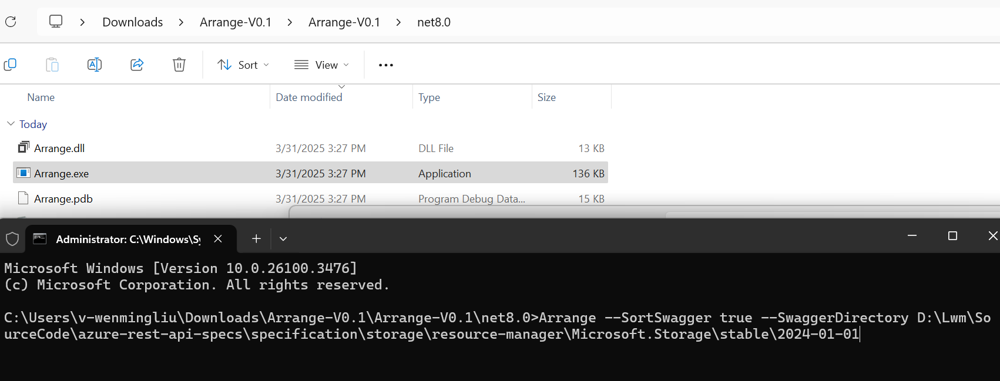

4. Wait for a while, the process would finish.

   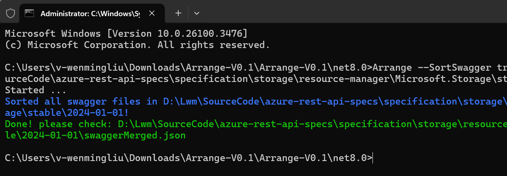

5. we got a newly created file `swaggerMerged.json` and it will be used in the following step.

### 6.2 Compare the `swaggerMerged.json` and `openapi.json`

After all the preparation work done above, then we should do swagger comparision work.

 - Hover on the `swaggerMerged.json` and right click, Choose: `Select for Compare`.
 - Hover on the TypeSpec generated swagger file (`openapi.json`) and right click, Choose: `Comapre with Selected`.
 - Then we get a two sides window showing the difference between the file we choosed above.

---

## 7. Fix Swagger differences
### 7.1 Common differences and repair methods
The goal is to ensure that the swagger generated by TSP is consistent with the original swagger
#### Renaming: "in": "body"
 The following is a code snippet with the operation ID `Vaults_CreateOrUpdate`
  - **The original swagger:**
    ```ts
    {
      "name": "parameters",
      "in": "body",
      "description": "Parameters to patch the vault",
      "required": true,
      "schema": {
        "$ref": "#/definitions/VaultPatchParameters"
      }
    }
    ```
  - **Swagger generated by TSP:**
    ```ts
    {
      "name": "properties",
      "in": "body",
      "description": "Parameters to patch the vault",
      "required": true,
      "schema": {
        "$ref": "#/definitions/VaultPatchParameters"
      }
    }
    ```
  - **Fix method**
    As shown above, the `name` has been changed.
    To fix this issue, we first need to find the corresponding TSP code location based on the operation ID.
    You can directly use the operability ID to search in the code, and perhaps find the corresponding TSP code location.If there is a `@operationId` decorator in the TSP code, you can directly use the operation ID to search for the corresponding TSP code snippet. If the decorator does not exist, you cannot directly search for the corresponding code. However, you can determine the location of the code through the operation ID, such as `Vaults_Update`, where `Vaults` represents the name of the interface and `Update` represents the name of the operation.
    The corresponding TSP code is as follows:
    ```ts
    @armResourceOperations
    interface Vaults {
      /**
      * Update a key vault in the specified subscription.
      */
      @parameterVisibility
      update is ArmCustomPatchSync<
        Vault,
        PatchModel = VaultPatchParameters,
        Response = ArmResponse<Vault> | ArmResourceCreatedSyncResponse<Vault>
      >;
    }
    ```
    After confirming the code, add the fix code in `client.tsp`
    ```ts
    @@clientName(Vaults.update::parameters.properties, "parameters");
    ```
    At last compile the converted TypeSpec into Swagger, fix works.
#### description diff
 - **The original swagger:**
    ```ts
    {
      "name": "parameters",
      "in": "body",
      "description": "Parameters to patch the vault",
      "required": true,
      "schema": {
      "$ref": "#/definitions/VaultPatchParameters"
      }
    }
    ```
  - **Swagger generated by TSP:**
    ```ts
    {
      "name": "parameters",
      "in": "body",
      "description": "The resource properties to be updated.",
      "required": true,
      "schema": {
        "$ref": "#/definitions/VaultPatchParameters"
      }
    }
    ```
  - **Fix method**
    In the swagger generated by TSP, the description in the body has changed.
    The fix method is similar to modifying the name, first locate the corresponding TSP code, and then add the fix code to **the corresponding TSP code file**.
    ```ts
    @@doc(Vaults.update::parameters.properties, "Parameters to patch the vault");
    ```
#### Response code differences
  Assuming the following differences appear in the comparison of Swagger
  - **The original swagger:**
    ```ts
    "responses": {
          "200": {
            "description": "Azure operation completed successfully.",
            "schema": {
              "$ref": "#/definitions/PrivateEndpointConnection"
            }
          },
          "204": {
            "description": "There is no content to send for this request, but the headers may be useful."
          },
          "default": {
            "description": "An unexpected error response.",
            "schema": {
              "$ref": "../../../../../common-types/resource-management/v5/types.json#/definitions/ErrorResponse"
            }
          }
        },
    ```
  - **Swagger generated by TSP:**
    ```ts
    "responses": {
          "200": {
            "description": "Azure operation completed successfully.",
            "schema": {
              "$ref": "#/definitions/PrivateEndpointConnection"
            }
          },
          "default": {
            "description": "An unexpected error response.",
            "schema": {
              "$ref": "../../../../../common-types/resource-management/v5/types.json#/definitions/ErrorResponse"
            }
          }
        },
    ```
  - **Fix method**
    After comparison, it can be found that the `204` response code is missing. 
  
    We can locate the corresponding TSP code based on the operation ID and perform the following repair operations
    ```ts
    Response = ArmResponse<PrivateEndpointConnection> | NoContentResponse
    ```
    `ArmResponse` corresponds to response code `200`, `NoContentResponse` corresponds to response code `204`.
    For more information about this section, please refer to [this file](https://github.com/Azure/typespec-azure/blob/main/packages/typespec-azure-resource-manager/lib/responses.tsp).

#### Missing extended attribute for marking long-running operations
  ```ts
    "x-ms-long-running-operation-options": {
          "final-state-via": "location"
        },
    "x-ms-long-running-operation": true
  ```
  When comparing two swagger files and the above code is missing, after finding the specified TSP code, When comparing two swagger files and the above code is missing, after finding the corresponding TSP code, specify the value of `LroHeaders`.
  ```ts
    createOrUpdate is ArmResourceCreateOrReplaceAsync<
      Vault,
      LroHeaders = ArmLroLocationHeader & Azure.Core.Foundations.RetryAfterHeader
    >;
  ```

#### Modification Type
  If it is necessary to modify the type of certain properties, you can use the `@@alternateType` augment decorator.

  The most common usage of this decorator as:
  ```js
  @@alternateType(VaultProperties.tenantId, uuid);
  @@alternateType(StorageTaskReportProperties.startTime,  offsetDateTime);
  @@alternateType(ImmutabilityPolicyProperties.etag, eTag);
  @@alternateType(NetworkSecurityPerimeter.location, azureLocation);
  @@alternateType(ResourceAccessRule.resourceId, armResourceIdentifier);
  @@alternateType(StorageAccountInternetEndpoints.blob, url);
  ```
  The augment decorator `@@alternateType` could accepet the third parameter, such as "csharp". It could specify the target language.

#### Missing format
  ```ts
  "AccessPolicyEntry": {
      "type": "object",
      "description": "An identity that have access to the key vault.",
      "properties": {
        "tenantId": {
          "type": "string",
          "format": "uuid",
          "description": "The Azure Active Directory tenant ID that should be used for authenticating requests to the key vault."
        },
      }
    },
  ```
  ```ts
  "AccessPolicyEntry": {
      "type": "object",
      "description": "An identity that have access to the key vault.",
      "properties": {
        "tenantId": {
          "type": "string",
          "description": "The Azure Active Directory tenant ID that should be used for authenticating requests to the key vault."
        },
      }
    },
  ```
  You can use `@format` to solve it.
  Find the corresponding TSP code and add the `@format` decorator above the property where format needs to be added
  ```ts
  model AccessPolicyEntry {
    /**
    * The Azure Active Directory tenant ID that should be used for authenticating requests to the key vault.
    */
    @format("uuid")
    tenantId: string;
  }
  ```
#### headers `Etag` fix
  - **The Origin Swagger**
    ```ts
    "responses": {
      "200": {
        "description": "OK -- Gets container ImmutabilityPolicy operation completed successfully.",
        "schema": {
          "$ref": "#/definitions/ImmutabilityPolicy"
        },
        "headers": {
          "ETag": {
          "type": "string",
          "description": "·····"
          }
        }
      }
    }
    ```
  - **Swagger generated by TSP:**
    ```ts
    "responses": {
        "200": {
        "description": "The request has succeeded.",
        "schema": {
          "$ref": "#/definitions/ImmutabilityPolicy"
        },
        "headers": {
          "e-tag": {
            "type": "string",
            "description": "····"
          }
        }
      }
    }
    ```
  - **Fix method**
    Find the corresponding TSP definition:
    ```ts
      getImmutabilityPolicy is ArmResourceRead<
        ImmutabilityPolicy,
        Parameters = {
          ·······
        },
        Response = ArmResponse<ImmutabilityPolicy> & {
        /**
        * The ETag HTTP response header. This is an opaque string. You can use it to detect whether the resource has changed between requests. In particular, you can pass the ETag to one of the If-Match or If-None-Match headers..
        */
        @header
          eTag: string;
        }
      >;
    ```
    Change 
    ```ts
      @header
          eTag: string;
    ```
    into
    ```ts
      @header("ETag")
          eTag: string;
    ```
#### Some warnings have appeared
  In the process of fixing the TSP code, we will see some warnings that should be eliminated as much as possible. To eliminate these warnings, we can use `#suppress` to solve them.
  Taking the code that just used `@format` as an example, in practical operation, we will find that `@format` will display a warning.
  Warning message:
  ```
  Azure services should not use the `@format` decorator.TypeSpec@azure-tools/typespec-azure-core/no-format
  ```
  Based on the warning message, we use `#suppress` to ignore this warning.
  ```ts
  model AccessPolicyEntry {
    /**
    * The Azure Active Directory tenant ID that should be used for authenticating requests to the key vault.
    */
    #suppress "@azure-tools/typespec-azure-core/no-format"
    @format("uuid")
    tenantId: string;
  }
  ```
#### example missing
  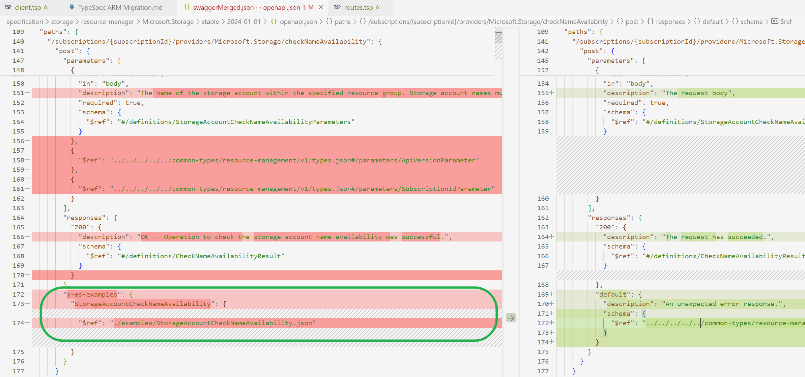

  1. go find the example file in the swagger directory like :
  `\azure-rest-api-specs\specification\storage\resource-manager\Microsoft.Storage\stable\2024-01-01\examples\StorageAccountCheckNameAvailability.json`

  2. copy and paste into the typespec directory like `\azure-rest-api-specs\specification\storage\Storage.Management\examples\2024-01-01\StorageAccountCheckNameAvailability.json`

  3. open exmaple file and add code like below

    >OpeationId is just the operationid in swagger or typespec file.
    
    >Title can be adopted from the swagger file.

    

  4. At last compile the converted TypeSpec into Swagger, fix works.

#### x-ms-pageable missing

  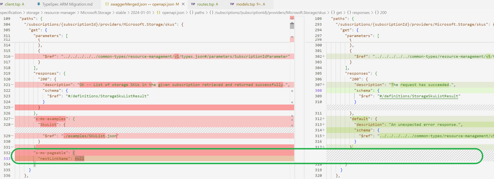

  1. go search `"Lists the available SKUs supported by Microsoft.Storage for given subscription."` which is the description of this opeation under `xxxx.Management` directory.
  2. locate and operation and the reponse definition.

     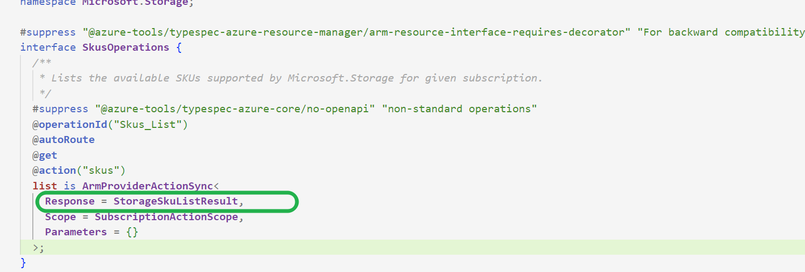
  3. Add nextLink Property as below.

     

  4. At last compile the converted TypeSpec into Swagger, fix works.

#### x-ms-enum name missing

  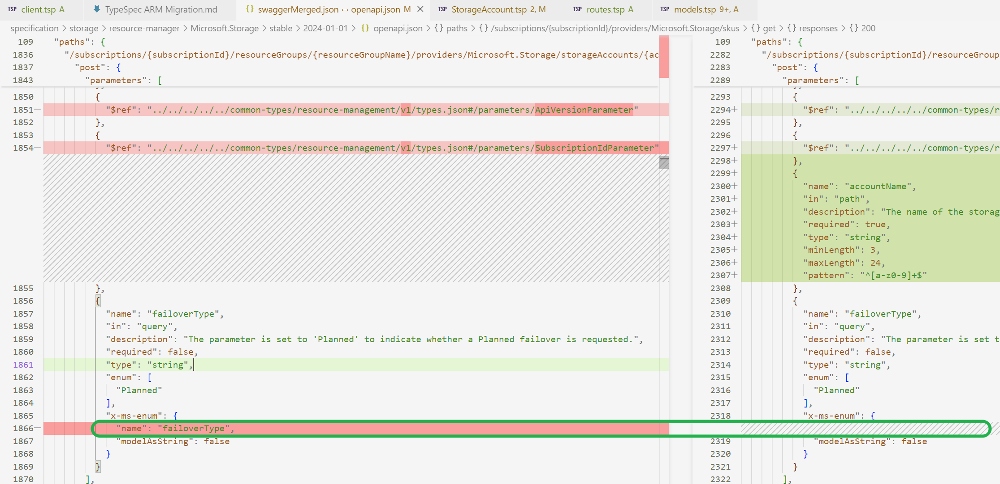

  1. go search the description or opeartionId and find the definition of this opeation.
  2. find this parameter definition.

     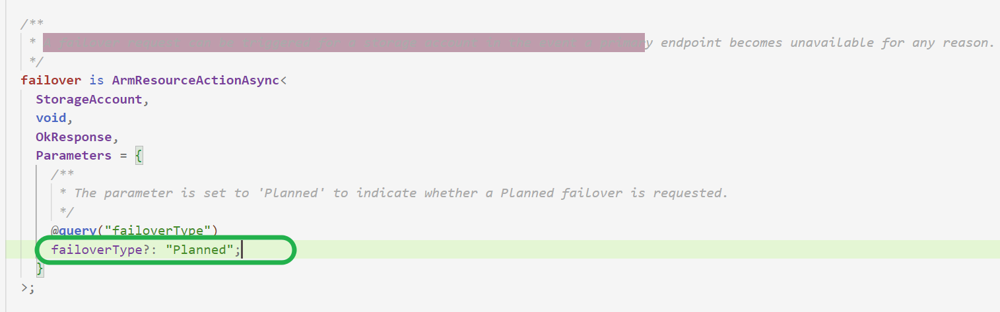

  3. Define an union in models.tsp

      ```ts
      #suppress "@azure-tools/typespec-azure-core/documentation-required" ""
      union FailoverType {
        Planned: "Planned",
        string,
      }
      ```
  
  4. change the parameter in step2 into as below
  `failoverType?: FailoverType = FailoverType.Planned`

  5. At last compile the converted TypeSpec into Swagger, fix works. It shoule be like this as below.
  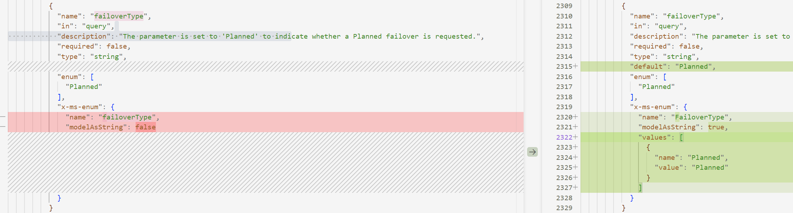

#### put operations have different body from its corresponding resource model.
As shown below, this is the Swagger code with operation ID `Vaults_CreateOrUpdate`. The original Swagger requires `VaultCreateOrUpdateParameters`, but the Swagger generated by TSP provides `Vault`.
  - **The original swagger:**
    ```ts
    {
      "name": "parameters",
      "in": "body",
      "description": "Parameters to create or update the vault",
      "required": true,
      "schema": {
        "$ref": "#/definitions/VaultCreateOrUpdateParameters"
      }
    }
    ```
  - **Swagger generated by TSP:**
    ```ts
    {
      "name": "parameters",
      "in": "body",
      "description": "Parameters to create or update the vault",
      "required": true,
      "schema": {
        "$ref": "#/definitions/Vault"
      }
    }
    ```
  - **Fix method**
  Locate the corresponding TSP code through the operation ID. The code is as follows
    ```ts
    @armResourceOperations
    interface Vaults {
      /**
      * Create or update a key vault in the specified subscription.
      */
      createOrUpdate is ArmResourceCreateOrReplaceAsync<Vault>;
    }
    ```
    From this, it can be seen that the problem is because the `VaultCreateOrUpdateParameters` were not passed to the `ArmResourceCreateOrReplacedAsync` template. However, since the `ArmResourceCreateOrReplacedAsync` template already has a request body parameter that cannot receive the `VaultCreateOrUpdateParameters`, we must change the template to solve this problem.
    Replace `ArmResourceCreateOrReplacedAsync` with `Azure.ResourceManager.Foundations.ArmCreateOperation`, and add decorator `@ armResourceCreateOrUpdate(Vault)`.
    Finally, add other necessary parameters.
    ```ts
    @armResourceOperations
    interface Vaults {
      /**
      * Create or update a key vault in the specified subscription.
      */
      @armResourceCreateOrUpdate(Vault)
      createOrUpdate is Azure.ResourceManager.Foundations.ArmCreateOperation<
        ResourceInstanceParameters<
          Vault,
          Azure.ResourceManager.Foundations.DefaultBaseParameters<Vault>
        >,
        VaultCreateOrUpdateParameters,
        Vault | ArmResourceCreatedResponse<
          Vault,
          LroHeaders = ArmLroLocationHeader & Azure.Core.Foundations.RetryAfterHeader
        >,
        ErrorResponse
      >;
    }
    ```

#### url path: default/singleton diff

  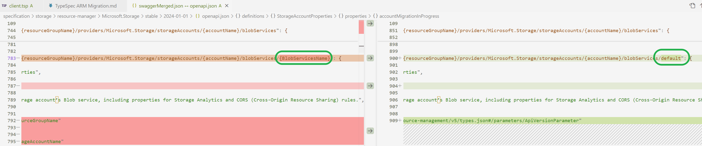

  1. go search the description or opeartionId and find the definition of this oeperation.

      

  2. remove the `@singleton("default")`

  3. compile the converted TypeSpec into Swagger, then it looks like.
      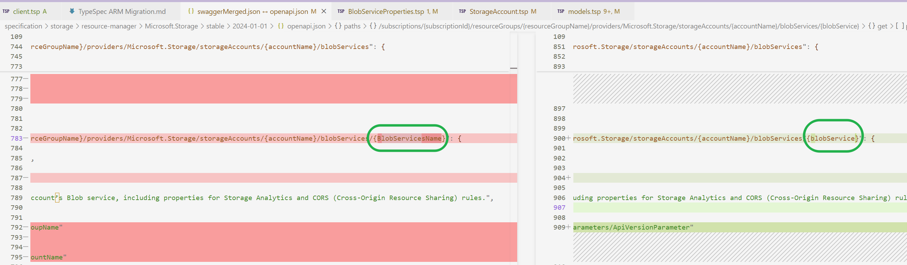
  
  4. we should make some change like this:
      ```ts
      model BlobServiceProperties
      is Azure.ResourceManager.ProxyResource<BlobServicePropertiesProperties> {
      ...ResourceNameParameter<
        Resource = BlobServiceProperties,
        KeyName = "BlobServicesName",
        SegmentName = "blobServices",
        NamePattern = ""
      >;
      ```
  5. At last compile the converted TypeSpec into Swagger, fix works.
   
#### Redundant 204 response 
  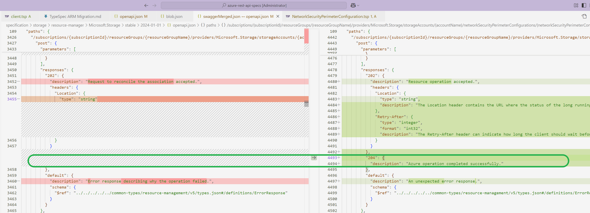

  1. go find the releated defintion
      ```ts
      reconcile is ArmResourceActionAsync<
      NetworkSecurityPerimeterConfiguration,
      void,
      void
      >;
      ```
  2. change it to:
      ```ts
      reconcile is ArmResourceActionAsyncBase<
      NetworkSecurityPerimeterConfiguration,
      void,
      BaseParameters = Azure.ResourceManager.Foundations.ResourceGroupBaseParameters,
      Response = ArmAcceptedLroResponse
      >;
      ```

  3. At last compile the converted TypeSpec into Swagger, fix works.
#### The value of 'require' in the body is false
  - **The original swagger:**
    ```ts
    {
      "name": "ListCredentialsRequest",
      "in": "body",
      "description": "Object of type ListCredentialsRequest",
      "required": false,
      "schema": {
        "$ref": "#/definitions/ListCredentialsRequest"
      }
    }
    ```
  - **Swagger generated by TSP:**
    ```ts
      {
        "name": "ListCredentialsRequest",
        "in": "body",
        "description": "The content of the action request",
        "required": true,
        "schema": {
          "$ref": "#/definitions/ListCredentialsRequest"
        }
      }
    ```
  - **Fix method**
    Find the corresponding TSP code snippet：
    ```ts
    listCredentials is ArmResourceActionSync<
      EndpointResource,
      ListCredentialsRequest,
      EndpointAccessResource,
      Azure.ResourceManager.Foundations.ExtensionBaseParameters,
      Parameters = {
        /**
         * The is how long the endpoint access token is valid (in seconds).
        */
        @maxValue(10800)
        @minValue(600)
        @query("expiresin")
        expiresin?: int64 = 10800;
      }
    >;
    ```
    Specify the value of requestbody
    ```ts
    listCredentials is ArmResourceActionSync<
      EndpointResource,
      ListCredentialsRequest,
      EndpointAccessResource,
      Azure.ResourceManager.Foundations.ExtensionBaseParameters,
      Parameters = {
        /**
        * The is how long the endpoint access token is valid (in seconds).
        */
        @maxValue(10800)
        @minValue(600)
        @query("expiresin")
        expiresin?: int64 = 10800;
      },
      RequestBody = {
        /**
        * Object of type ListCredentialsRequest
        */
        @body ListCredentialsRequest?: ListCredentialsRequest;
      }
    >;
    ```
    The `ListCredentialsRequest` following `@body` will become the name of the body
#### Missing "x-ms-skip-url-encoding": true
  - **The original swagger**:
    ```ts
    {
      "name": "endpointName",
      "in": "path",
      "description": "The endpoint name.",
      "required": true,
      "type": "string",
      "x-ms-skip-url-encoding": true
    }
    ```
  - **Swagger generated by TSP**:
    ```ts
    {
      "name": "endpointName",
      "in": "path",
      "description": "The endpoint name.",
      "required": true,
      "type": "string"
    }
    ```
  - **Fix method**
    Find the corresponding TSP code based on `"name": "endpointName"`.
    ```ts
    model EndpointResource
      is Azure.ResourceManager.ExtensionResource<EndpointProperties> {
      ...ResourceNameParameter<
        Resource = EndpointResource,
        KeyName = "endpointName",
        SegmentName = "endpoints",
        NamePattern = ""
      >;
    }
    ```
    Add the following code to the file where the `EndpointResource` is located to fix it.
    ```ts
    @@path(EndpointResource.name, #{ allowReserved: true });
    ```
#### Change ArmResourcePatchSync to ArmCustomPatchSync
If the template used in the `update` operation is `ArmResourcePatchSync`, we need to change it to `ArmCustomPatchSync`.
- **Original TSP code**:
  ```ts
  @armResourceOperations
  interface PublicCloudConnectors {
  update is ArmResourcePatchSync<
    PublicCloudConnector,
    PublicCloudConnectorProperties
  >;
  }
  ```
- **Fix steps**
  - **Step 1**, replace `ArmResourcePatchSync` directly with `ArmCustomPatchSync`
    ```ts
    @armResourceOperations
    interface PublicCloudConnectors {
      update is ArmCustomPatchSync<
        PublicCloudConnector,
        PublicCloudConnectorProperties
      >;
    }
    ```
  - **Step 2**, run `tsp compile .`
    After compilation, it will be found that Swagger has changed.
    - **The original swagger**
    ```ts
     {
        "name": "properties",
        "in": "body",
        "description": "The resource properties to be updated.",
        "required": true,
        "schema": {
          "$ref": "#/definitions/PublicCloudConnectorUpdate"
        }
     }
    ```
    - **Modified Swagger**
    ```ts
    {
      "name": "properties",
      "in": "body",
      "description": "The resource properties to be updated.",
      "required": true,
      "schema": {
        "$ref": "#/definitions/PublicCloudConnectorProperties"
      }
    }
    ```
    - **The following code has been deleted after modification**
    ```ts

    "AwsCloudProfileUpdate": {
      "type": "object",
      "description": "cloud profile for AWS.",
      "properties": {
        "excludedAccounts": {
          "type": "array",
          "description": "List of AWS accounts which need to be excluded.",
          "items": {
            "type": "string"
          }
        }
      }
    },
    "PublicCloudConnectorPropertiesUpdate": {
      "type": "object",
      "description": "Properties of public cloud connectors.",
      "properties": {
        "awsCloudProfile": {
          "$ref": "#/definitions/AwsCloudProfileUpdate",
          "description": "Cloud profile for AWS."
        }
      }
    },
    "PublicCloudConnectorUpdate": {
      "type": "object",
      "description": "Public Cloud Connector",
      "properties": {
        "properties": {
          "$ref": "#/definitions/PublicCloudConnectorPropertiesUpdate",
          "description": "The resource-specific properties for this resource.",
          "x-ms-client-flatten": true
        }
      },
      "allOf": [
        {
          "$ref": "#/definitions/TrackedResourceUpdate"
        }
      ]
    },
    "TrackedResourceUpdate": {
      "type": "object",
      "description": "The resource model definition for an Azure Resource Manager tracked top level resource which has 'tags' and a 'location'",
      "properties": {
        "tags": {
          "type": "object",
          "description": "Resource tags.",
          "additionalProperties": {
            "type": "string"
          }
        }
      },
      "allOf": [
        {
          "$ref": "../../../../../common-types/resource-management/v5/types.json#/definitions/Resource"
        }
      ]
    },
    ```
  - **Step 3**, in order to ensure that the swagger generated by TSP is consistent with the original swagger, we need to add the deleted code back and modify the incorrect code
- **Fixed code**:
  ```ts
  @doc("Public Cloud Connector")
  model PublicCloudConnectorUpdate extends TrackedResourceUpdate {
    @doc("The resource-specific properties for this resource.")
    @Azure.ResourceManager.Private.conditionalClientFlatten
    properties?: PublicCloudConnectorPropertiesUpdate;
  }

  @doc("The resource model definition for an Azure Resource Manager tracked top level resource which has 'tags' and a 'location'")
  model TrackedResourceUpdate extends Azure.ResourceManager.CommonTypes.Resource {
    @doc("Resource tags.")
    tags?: Record<string>;
  }

  @doc("Properties of public cloud connectors.")
  model PublicCloudConnectorPropertiesUpdate {
    @doc("Cloud profile for AWS.")
    awsCloudProfile?: AwsCloudProfileUpdate;
  }

  @doc("cloud profile for AWS.")
  model AwsCloudProfileUpdate {
    @doc("List of AWS accounts which need to be excluded.")
    excludedAccounts?: string[];
  }

  @armResourceOperations
  interface PublicCloudConnectors {
    update is ArmCustomPatchSync<
      PublicCloudConnector,
      PublicCloudConnectorUpdate
    >;
  }
  ```

### 7.2 Negligible differences
#### Operation tags
  ```ts
  "get": {
    "operationId": "MHSMPrivateLinkResources_ListByMHSMResource",
    "tags": [
      "MHSMPrivateLinkResources"
    ]
  }
  ```
  ```ts
   "get": {
    "operationId": "MHSMPrivateLinkResources_ListByMHSMResource",
    "tags": [
      "ManagedHsms"
    ]
  }
  ```
#### The value of nextlink in x-ms-pageable
  ```ts
  "x-ms-pageable": {
    "nextLinkName": "null"
  }
  ```
  ```ts
  "x-ms-pageable": {
    "nextLinkName": "nextlink"
  }
  ```
#### Response description
 ```ts
  "responses": {
    "200": {
      "description": "Created or updated vault",
      "schema": {
        "$ref": "#/definitions/Vault"
      }
    }
  }
  ```
  ```ts
  "responses": {
    "200": {
      "description": "The request has succeeded.",
      "schema": {
        "$ref": "#/definitions/Vault"
      }
    }
  }
  ```
#### Equivalent $ref and inline content
  ```ts
  {
    "name": "resourceGroupName",
    "in": "path",
    "description": "The name of the Resource Group to which the server belongs.",
    "required": true,
    "type": "string"
  },
  {
    "$ref": "#/parameters/ApiVersionParameter"
  },
  {
    "$ref": "#/parameters/SubscriptionIdParameter"
  }
  ```
  ```ts
  {
    "$ref": "../../../../../common-types/resource-management/v5/types.json#/parameters/ApiVersionParameter"
  },
  {
    "$ref": "../../../../../common-types/resource-management/v5/types.json#/parameters/SubscriptionIdParameter"
  },
  {
    "$ref": "../../../../../common-types/resource-management/v5/types.json#/parameters/ResourceGroupNameParameter"
  },
  ```
#### Headers in response code
  ```ts
  "201": {
    "description": "Created or updated vault",
    "schema": {
    "$ref": "#/definitions/Vault"
    }
  },
  ```
  ```ts
  "201": {
    "description": "Resource 'Vault' create operation succeeded",
    "schema": {
      "$ref": "#/definitions/Vault"
    },
    "headers": {
      "Location": {
      "type": "string",
      "description": "The Location header contains the URL where the status of the long running operation can be checked."
      },
      "Retry-After": {
      "type": "integer",
      "format": "int32",
      "description": "The Retry-After header can indicate how long the client should wait before polling the operation status."
      }
    }
  },
  ```
-----

## 8. Error/Warning Handling

### Error: ambiguous name: ProxyResource

- Error Message:
  ```
  error ambiguous-symbol: "ProxyResource" is an ambiguous name between Azure.ResourceManager.ProxyResource, Azure.ResourceManager.Foundations.ProxyResource. Try using fully qualified name instead: Azure.ResourceManager.ProxyResource, Azure.ResourceManager.Foundations.ProxyResource
  > 5640 | model StorageTaskReportInstance extends ProxyResource {
        |                                         ^^^^^^^^^^^^^

  Found 1 error.
  ```
- Error Code:
  ```ts
  /**
  * Storage Tasks run report instance
  */
  #suppress "@azure-tools/typespec-azure-core/composition-over-inheritance" "For backward compatibility"
  model StorageTaskReportInstance extends ProxyResource {
    /**
    * Storage task execution report for a run instance.
    */
    properties?: StorageTaskReportProperties;
  }
  ```
- How to fix

   Use `Azure.ResourceManager.Foundations.ProxyResource` instead of `ProxyResource`

### Warning: Missing identifying properties of objects in the array item
- Warning Message:
  ```
  Missing identifying properties of objects in the array item, please add @OpenAPI.extension("x-ms-identifiers", [<prop>]) to specify it. If there are no appropriate identifying properties, please add @OpenAPI.extension("x-ms-identifiers",[]).
  4920 |   sshAuthorizedKeys?: SshPublicKey[];
       |   ^^^^^^^^^^^^^^^^^
  ```

- Error Code:

    ```ts
    /**
    * The Storage Account Local User keys.
    */
    model LocalUserKeys {
      /**
      * Optional, local user ssh authorized keys for SFTP.
      */
      sshAuthorizedKeys?: SshPublicKey[];
    }
    ```
- How to fix
  1. go find the `SshPublicKey` definition in the original swagger file:
      ```
      "SshAuthorizedKeys": {
      "type": "array",
      "items": {
        "$ref": "#/definitions/SshPublicKey"
      },
      "description": "Optional, local user ssh authorized keys for SFTP."
      }
      ```   

  2. there is no `x-ms-identifiers` property, so we should just add decorator as below:
      ```ts
      model LocalUserKeys {
        /**
        * Optional, local user ssh authorized keys for SFTP.
        */
        @OpenAPI.extension("x-ms-identifiers", [])
        sshAuthorizedKeys?: SshPublicKey[];
      }
      ```
      if there is a  property like 
      ``` ts
      "x-ms-identifiers": ["name"]
      ```
      The decorator should be like 
      ```ts
      @OpenAPI.extension("x-ms-identifiers", ["name"])
      sshAuthorizedKeys?: SshPublicKey[];
      ```

### Generate SDK Unhandled exception: method does not exist.

- Error Message:
  `Unhandled exception. System.Exception: The StorageAccountsOperations_CheckNameAvailability method does not exist.`

- Error Code:
  ```ts
  interface StorageAccountsOperations {
  /**
   * Checks that the storage account name is valid and is not already in use.
   */
  #suppress "@azure-tools/typespec-azure-core/no-openapi" "non-standard operations"
  @operationId("StorageAccounts_CheckNameAvailability")
  @autoRoute
  checkNameAvailability is ArmProviderActionSync<
    Request = StorageAccountCheckNameAvailabilityParameters,
    Response = CheckNameAvailabilityResult,
    Scope = SubscriptionActionScope,
    Parameters = {}
  >;
  }
  ```

- How to fix

  `@operationId("StorageAccounts_CheckNameAvailability")` is not couraged to use to change opeartionId.
  The normal way is to apply `interfaceName_OperationName`  as operationId.
  we should find the interface `StorageAccounts`.
  Then move the the orginial operation definiton into `StorageAccounts` interface and remove decorator `@operationId("StorageAccounts_CheckNameAvailability")`

  But if there is no same interface name  exists, we should rename this interface to this name and and remove `@operationId` decorator.


## 9. Generate SDK from TSP And fix SDK differences
### 9.1 Initial pass through checklist
- Could compile successfully and should have no warnings.
- Configure your tspconfig.yaml. 
  ```ts
  emit:
    - "@azure-tools/typespec-autorest"
  options:
    "@azure-tools/typespec-autorest":
      use-read-only-status-schema: true
      omit-unreachable-types: true
      emitter-output-dir: "{project-root}/.."
      azure-resource-provider-folder: "resource-manager"
      output-file: "{azure-resource-provider-folder}/{service-name}/{version-status}/{version}/openapi.json"
      examples-dir: "{project-root}/examples"
      arm-resource-flattening: true
    "@azure-tools/typespec-csharp":
      flavor: "azure"
      namespace: "Azure.ResourceManager.Storage"
      clear-output-folder: true
      examples-dir: "{project-root}/examples"
      package-dir: "Azure.ResourceManager.Storage"
  
  linter:
    extends:
      - "@azure-tools/typespec-azure-rulesets/resource-manager"
  ```
  When attempting to generate SDK code using TSP, it is necessary to check if there is an emitter used for generating SDK code.
  As shown in the code above, `@azure-tools/typespec-csharp` is an emitter used to generate .Net SDK code.


### 9.2  Prepare `tsp-location.yaml`
Create a `tsp-location.yaml` under like `\azure-sdk-for-net\sdk\storage\Azure.ResourceManager.Storage\`.
The content shoud be like:

```ts
directory: specification/storage/Storage.Management
repo: Azure/azure-rest-api-specs
commit: ff54cf5ec15ad0bb4e52124e22f4d778e497ede5
```
Note: 
The `commit` should be a valid commit id in Sepc repo.


### 9.3 Generate code from typespec

Please run command like:

    `dotnet build /t:GenerateCode /p:LocalSpecRepo="D:\Lwm\SourceCode\azure-rest-api-specs\specification\storage\Storage.Management\"`

under the path like `\azure-sdk-for-net\sdk\storage\Azure.ResourceManager.Storage\`.

It would generate SDK with TSP you provided.

### 9.4 Fix SDK differences and errors

we should run like `..\..\..\eng\scripts\Export-API.ps1 storage` to export the api changes. 

In the following part, we will fix some SDK differences or errors during the export api process / dotnet build.

#### The type or namespace could not be found

> BlobContainerCollection.cs(52,108): error CS0246: The type or namespace name 'BlobContainerState' could not be found (are you missing a using directive or an assembly reference?)

The error is caused by api compat check.

if we find the `BlobContainerState` in the tsp or swagger file, there dose not exist. 
If so we should do a search in `autorest.md`, Then we find `ListContainersInclude: BlobContainerState`, we should do a search for `ListContainersInclude` in Tsp.

we should do a coresponding rename in `client.tsp`:

`@@clientName(ListContainersInclude, "BlobContainerState");`


#### client name difference fix
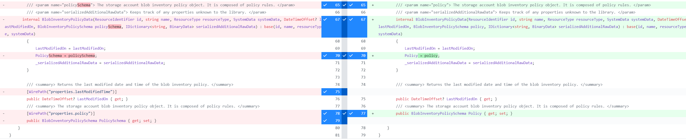

As we can see , the client name is differenct. So we find the definition of `BlobInventoryPolicyData` in typespec.

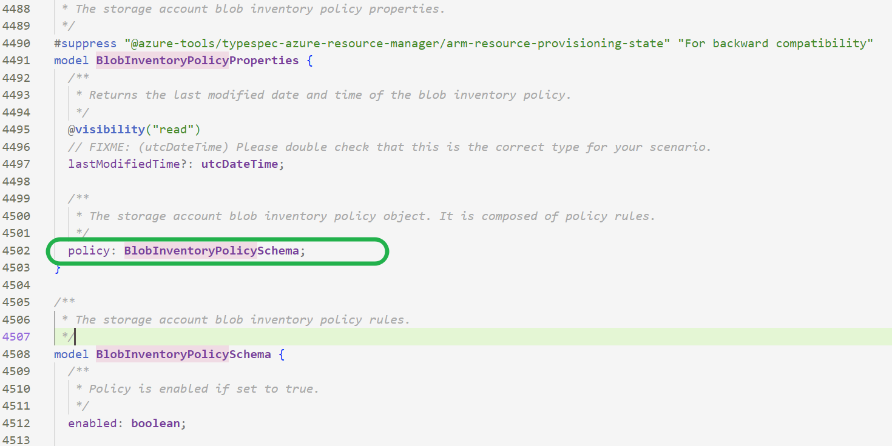

And now we could locate the releated property and make cline name fix in `client.tsp` as below：
`@@clientName(BlobInventoryPolicyProperties.policy, "PolicySchema");`

#### opeartion id difference: could ignore
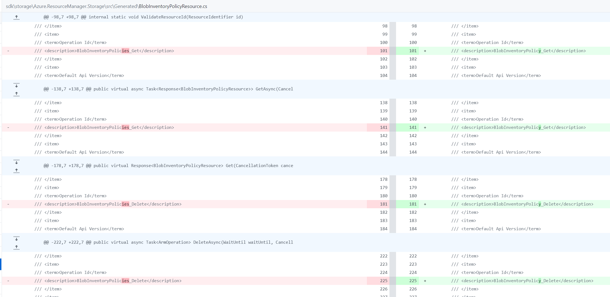

