# TypeSpec ARM Migration

### Getting started with TypeSpec migration
Getting started with TypeSpec migration
We have created a swagger to TypeSpec conversion tool to help take on the bulk of the manual conversion labor. It can handle both data-plane and management-plane swaggers. The produced TypeSpec relies on the Azure.Core and Azure.Resource.Manager libraries.

**Important**! Because TypeSpec is more expressive than Swagger and with the help of evolving Azure libraries, this tool should only be used as an aid in the conversion/migration process, not as the sole tool to produce final version of TypeSpec specs without human inspection, correction and optimization.

---

## 1. The Spec to be checked out
In order to Make a comparsion of C# Code generation, we should check out the specification code aligning with that used in SDK repo.
For example:
If you are working on a Swagger generated SDK RP, Then you should go find the commit id in the `autorest.md`.
Otherwise, you should go find the commit id in the `tsp-location.yaml` for a TypeSpec generated SDK RP.

After that ,you should checkout the specific commit id under azure-rest-api-specs Repo directory like:
```
git checkout -b new-branch-name xxxx
```
`new-branch-name` should be replaced by a user defined name.
`xxxx` is the commit id you got in the above.

After all the work done successfully, you get a version of azure-rest-api-specs which the SDK is currently using.

## 2.Softwares to install

✅Ensure Node.js 18.3 LTS or later is installed.

✅Ensure the latest Visual Studio Code is installed.


## 3. Environment Preparation
✅ ​**DO** install @typespec/compiler
```
npm install -g @typespec/compiler
```

✅ ​**DO**
Run at root of azure-rest-api-specs
```Terminal window
npm install 
 ```

✅ ​**DO** name your ARM spec folder with  `{{YourService}}.Management`（e.g：`Storage.Management`）under Resource Provider specification folder like :
`\azure-rest-api-specs\specification\storage\Storage.Management\`

---
## 4.Convert a control-plane specification

Run under the directory of step 2 which is `{{YourService}}.Management` for which outputs TypeSpec in this directory. 
Ensure it compiles successfully locally.
```
tsp-client convert --swagger-readme [path to readme.md] --arm --fully-compatible
```
By default, the converted TypeSpec project will leverage TypeSpec built-in libraries with standard patterns and templates (highly recommended), 
which will cause discrepancies between the generated TypeSpec and original swagger which we will mitigate this in the following steps.

---
## 5. Compie the converted TypeSpec into Swagger for comparsion between original Swagger.

Run under the directory of step 2 which is `{{YourService}}.Management`. Ensure it compiles successfully locally.
```
tsp compile client.tsp 
```
It will ouput a file called `openapi.json` under nder Resource Provider specification folder like :
`\azure-rest-api-specs\specification\storage\resource-manager\Microsoft.Storage\stable\2024-01-01`

`2024-01-01`  corresponds with the version tag in the `readme.md` under `resource-manager` foder like `\azure-rest-api-specs\specification\storage\resource-manager\readme.md`

---

## 6. Initial pass through checklist
✅ ​**DO** configure your tspconfig.yaml. 
```ts
emit:
  - "@azure-tools/typespec-autorest"
options:
  "@azure-tools/typespec-autorest":
    use-read-only-status-schema: true
    omit-unreachable-types: true
    emitter-output-dir: "{project-root}/.."
    azure-resource-provider-folder: "resource-manager"
    output-file: "{azure-resource-provider-folder}/{service-name}/{version-status}/{version}/openapi.json"
    examples-dir: "{project-root}/examples"
    arm-resource-flattening: true
  "@azure-tools/typespec-csharp":
    flavor: "azure"
    namespace: "Azure.ResourceManager.Storage"
    clear-output-folder: true
    examples-dir: "{project-root}/examples"
    package-dir: "Azure.ResourceManager.Storage"
 
linter:
  extends:
    - "@azure-tools/typespec-azure-rulesets/resource-manager"
```
"@azure-tools/typespec-csharp": part is proboberly missing. It's intended for C# code generation.
You should Change some keyword for you RP instead of just copy and paste.


✅ ​**DO** ensure interface Operations extends Azure.ResourceManager.Operations {} is in main.tsp

```

✅ ​**DO** remove `@useAuth(AadOauth2Auth<["user_impersonation"]>)`

/**
 * The Operations interface for the Storage namespace.
 */
interface Operations extends Azure.ResourceManager.Operations {}
```

✅ ​**DO** make client customizations in a client.tsp file

❌ **DON’T** import or use @azure-tools/typespec-client-generator-core in other files aside from client.tsp.

✅ ​**DO** run tsp compile . on your specification and address all warnings

✅ ​**DO** use union instead of enum to define Azure extensible enums

---

## 7. Resolving Swagger Breaking Change Violations
The Swagger Converter will not be able to accurately represent every part of every API in TypeSpec. This document outlines some common changes you might need to make to a converted TypeSpec to make it conform to your existing service API and pass check-in validations.

### 7.1 Update existing swagger files
Run the tool to sort existing swagger so you can easily compare with TypeSpec generated swagger. 
Please note this functionality has been added in version 0.10.0. Please update to latest if you don’t see this command option.

```Terminal window
tsp-client sort-swagger [path to existing swagger]
```

> Note:
It should have some changes for the sorted exsiting swagger, but it should not commit finally.

### 7.2 Comparing the sorted swagger with TypeSpec generated swagger

After all the preparation work done above, then we should do swagger comparision work.

 1. Hover on the sorted swagger file and right click, Choose: Select for Compare.
 2. Hover on the TypeSpec generated swagger file (openapi.json) and right click, Choose: Comapre with Selected.
 3. Then we get a two window showing the difference between the file we choosed above. we would  show some diffs and how to fix as tutorial in the following content.

---

## 8. Diff Fixing

### - Can ignore: Tags Difference and securityDefinitions.description
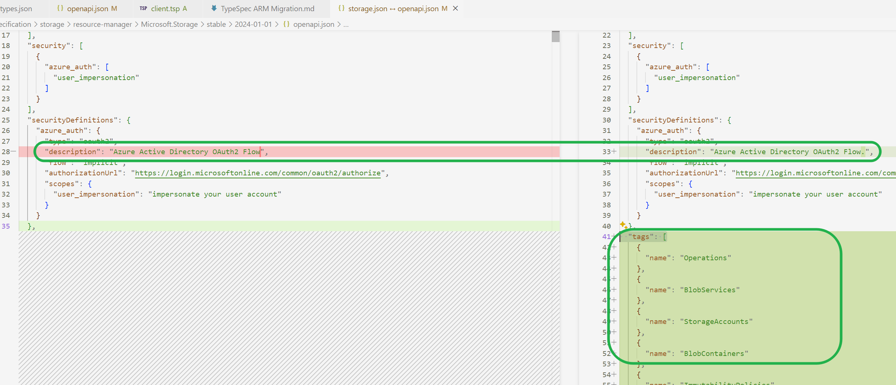
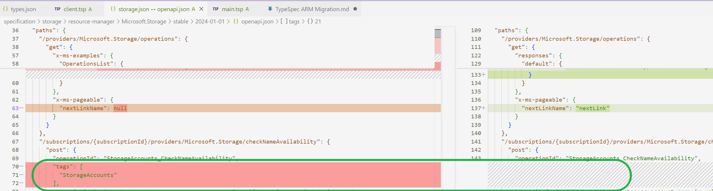
### - Can ignore: x-ms-pageable
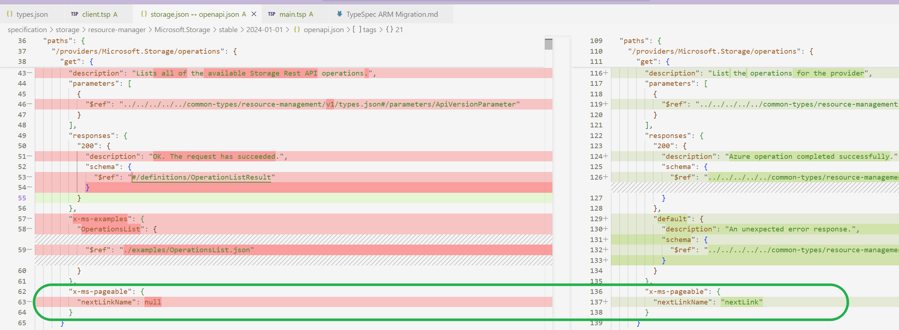

### - renaming: "in": "body"
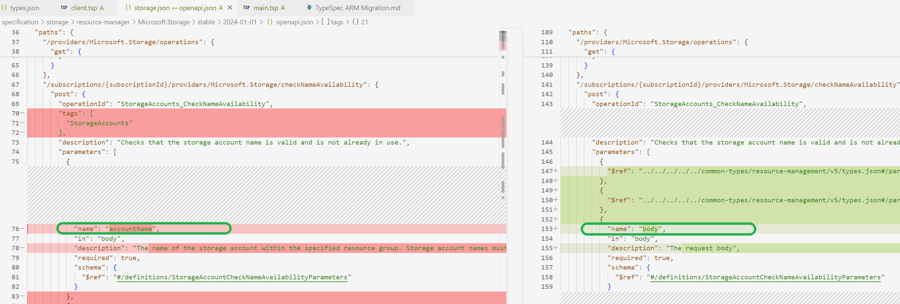

1. go search the definition of this operation in typespec directory like below:
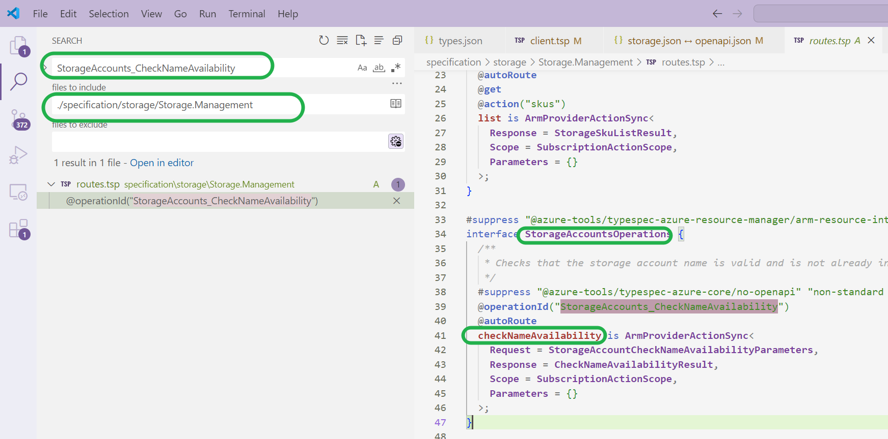
we got the interface: StorageAccountsOperations
we got the operation name:checkNameAvailability

And we could add these fix statement in client.tsp:
`@@clientName(StorageAccountsOperations.checkNameAvailability::parameters.body,
  "accountName"
);`

At last run: `tsp compile client.tsp`, fix works.

### - description diff
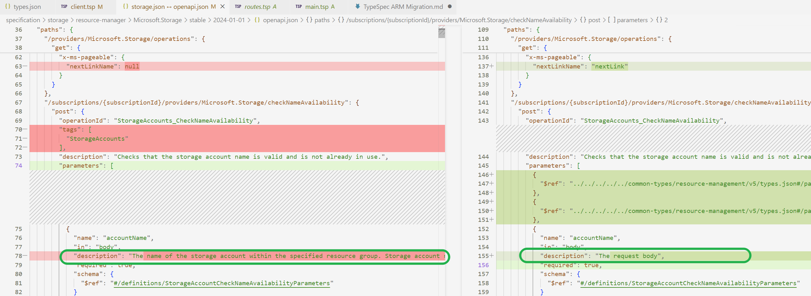

We should fix the description's diff at the bottom of  the source file instead of client.tsp

`@@doc(StorageAccountsOperations.checkNameAvailability::parameters.body,
  "The name of the storage account within the specified resource group. Storage account names must be between 3 and 24 characters in length and use numbers and lower-case letters only."
);
`
At last run: `tsp compile client.tsp`, fix works.


### - example missing
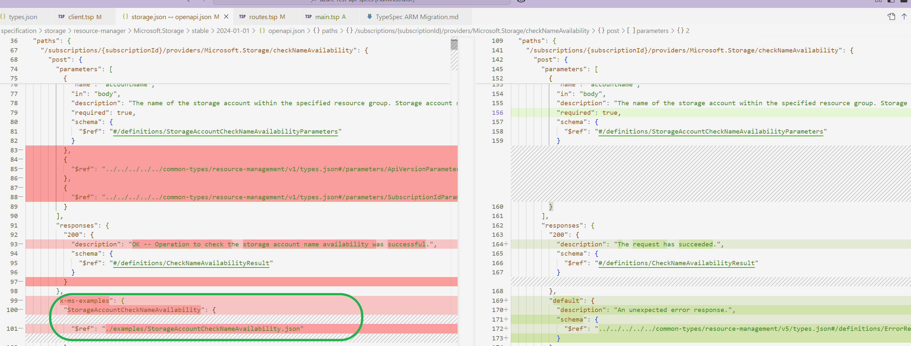

1. go find the example file in the swagger directory like :
`\azure-rest-api-specs\specification\storage\resource-manager\Microsoft.Storage\stable\2024-01-01\examples\StorageAccountCheckNameAvailability.json`

2. copy and paste into the typespec directory like `\azure-rest-api-specs\specification\storage\Storage.Management\examples\2024-01-01\StorageAccountCheckNameAvailability.json`

3. open exmaple file and add code like below

    >OpeationId is just the operationid in swagger or typespec file.
    
    >Title can be adopted from the swagger file.

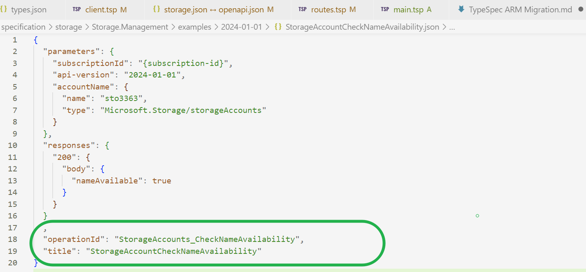

4. run: `tsp compile client.tsp`, fix works.

### - Can ignore: Response description
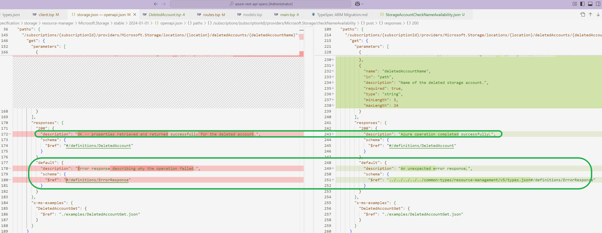
 

## - Can ignore: Operation tags
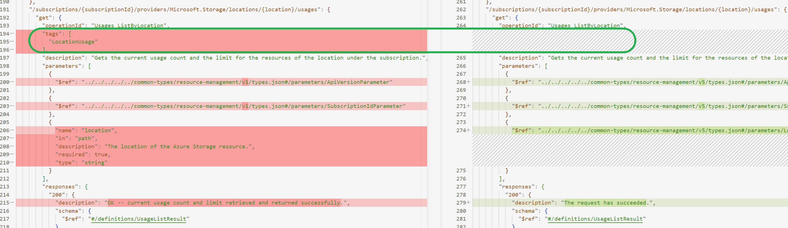

## - Equivalent
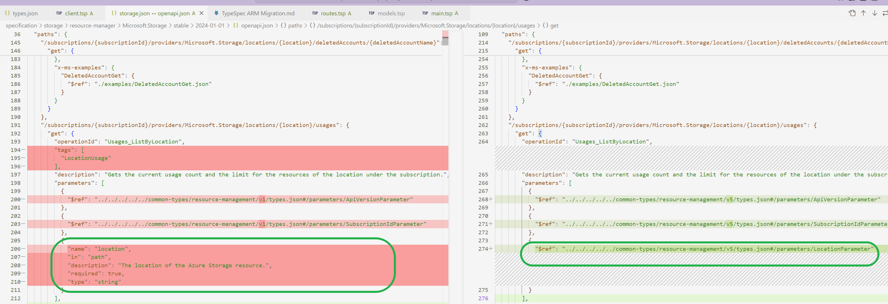

-----

# 9. Error Handling
## Error: ambiguous name: ProxyResource

### Error Message:
```richText
error ambiguous-symbol: "ProxyResource" is an ambiguous name between Azure.ResourceManager.ProxyResource, Azure.ResourceManager.Foundations.ProxyResource. Try using fully qualified name instead: Azure.ResourceManager.ProxyResource, Azure.ResourceManager.Foundations.ProxyResource
> 5640 | model StorageTaskReportInstance extends ProxyResource {
       |                                         ^^^^^^^^^^^^^

Found 1 error.
```
### Error Code:
```ts
/**
 * Storage Tasks run report instance
 */
#suppress "@azure-tools/typespec-azure-core/composition-over-inheritance" "For backward compatibility"
model StorageTaskReportInstance extends ProxyResource {
  /**
   * Storage task execution report for a run instance.
   */
  properties?: StorageTaskReportProperties;
}
```
### How to Fix
ProxyResource => Azure.ResourceManager.Foundations.ProxyResource


